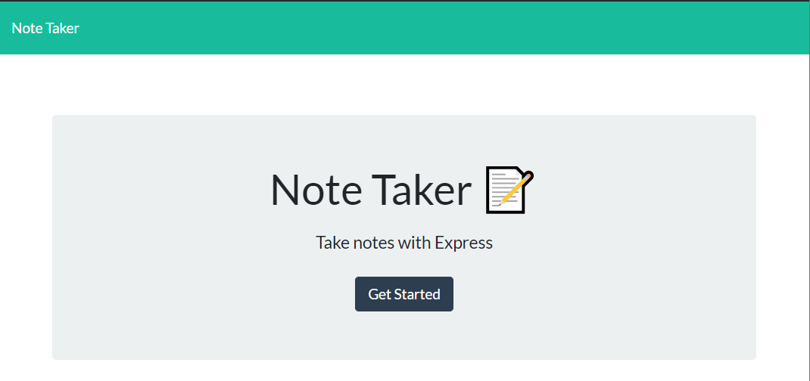
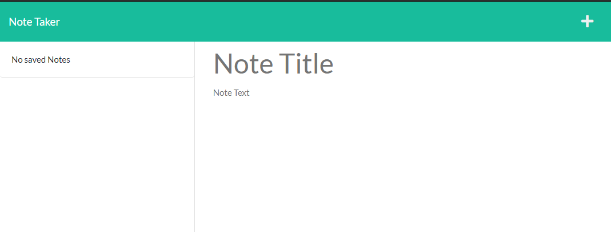
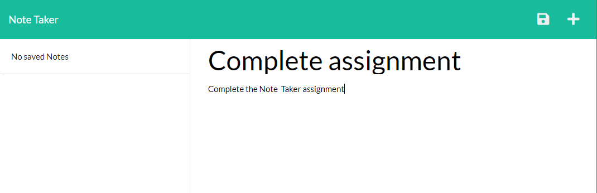
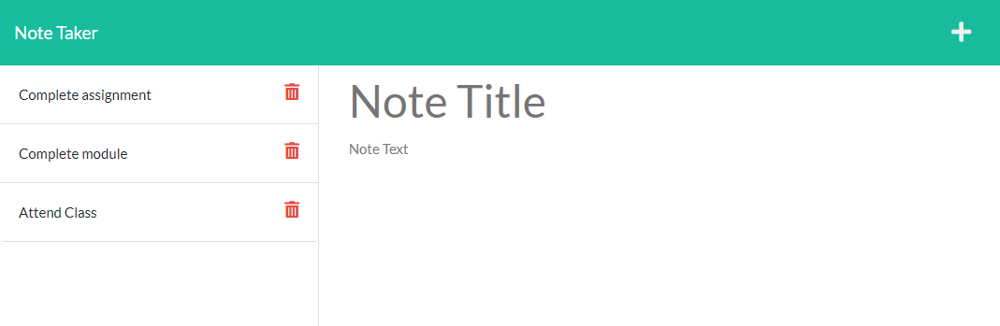

# NOTE TAKER
## Version 1.0
## Description
This app allows user to write notes and save them. User also has the option to delete notes if they are no longer required. All notes are saved and visible on the left hand side of the notes page, everytime its loaded.

## Table of Contents
* [License](#license)
* [Installation](#installation)
* [Test](#test)
* [Usage](#usage)
* [Credits](#credits)

## License

## Installation
There is no installation required. App is available online at the below link.

[Link to NOTE TAKER](https://tragically-donair-32034.herokuapp.com/)

## Test
Testing is not available at the moment.

## Usage
* To start adding notes go to [Note Taker homepage](https://tragically-donair-32034.herokuapp.com/) and click get started.

* You will see the notes page as shown below.

* Fill out Note Title and Note Text on the right hand side.
* Once both sections are filled, save button will appear on top as shown below.

* Click on save button to save the note.
* Saved notes will appear on the left hand column as shown below.

* Clicking on a saved note will display it on the right hand section.
* To add new note, click on the plus icon on top.

> Delete note option has been added.
* Click on the trash icon on the saved notes to delete it.

## Credits
#### NPM Modules
* [Express](https://www.npmjs.com/package/express)

#### Users
* Abhishek Jamwal - [GitHub](https://github.com/jamwalab)